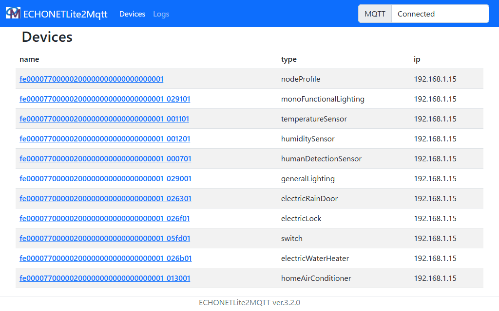
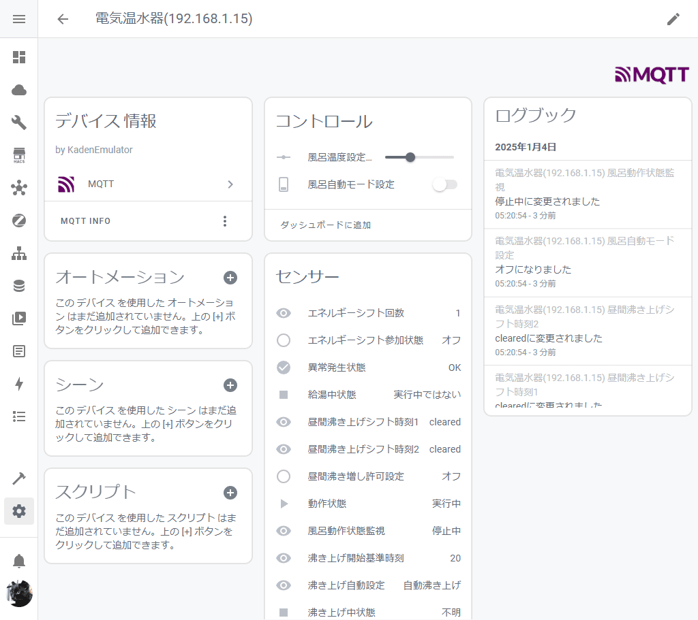
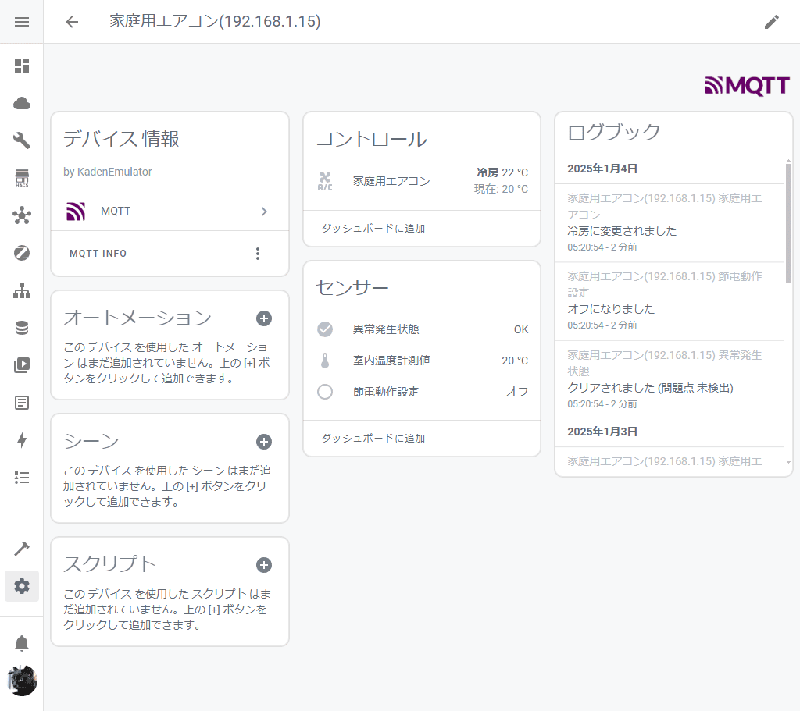

# ECHONETLite2MQTT Home Assistant Bridge

[](LICENSE)


## 概要

[ECHONETLite2MQTT](https://github.com/banban525/echonetlite2mqtt)で検出されたデバイスを、[Home Assistant](https://www.home-assistant.io/)のデバイスとして自動検出させるためのアプリケーションです。

また特定のプロパティに対し、定期的に[更新要求](https://github.com/banban525/echonetlite2mqtt/blob/master/README.ja.md#2-echonet-lite-%E6%A9%9F%E5%99%A8%E3%81%8C%E8%87%AA%E5%8B%95%E3%81%A7%E3%83%97%E3%83%AD%E3%83%91%E3%83%86%E3%82%A3%E3%82%92%E9%80%81%E3%82%89%E3%81%AA%E3%81%84%E3%81%AE%E3%81%8B%E3%82%82)を送信します。

ECHONET Liteの仕様では取得できない設定値(エアコン設定温度の範囲など)は、[deviceConfig.ts](src/deviceConfig.ts)で管理しています。

## 使い方

### Production

```sh
npm install
npm run build

export MQTT_BROKER="mqtt://localhost"
export MQTT_USERNAME="username"
export MQTT_PASSWORD="password"

node dist/index
```

### Development

```sh
cat .env
MQTT_BROKER=mqtt://localhost
MQTT_USERNAME=username
MQTT_PASSWORD=password
LOG_LEVEL=debug

npm install
npm run dev
```

### Docker

```sh
docker build -t e2m-hass-bridge .
docker run -d \
  --name e2m-hass-bridge \
  -e MQTT_BROKER=mqtt://localhost \
  -e MQTT_USERNAME=username \
  -e MQTT_PASSWORD=password \
  -p 3000:3000 \
  --restart always \
  e2m-hass-bridge
```

## デモ

[echonet-lite-kaden-emulator](https://github.com/banban525/echonet-lite-kaden-emulator)を利用しています。







